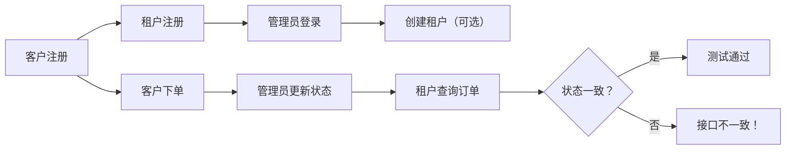

> 🔑 **核心原则**：  
> - **所有 API 修改必须先更新 `openapi.yaml`**  
> - 前后端开发均以 `openapi.yaml` 为唯一接口依据

---

## 🚀 快速启动

### 1️⃣ 启动后端服务

```bash
# 进入后端目录
cd backend

# 安装依赖（首次运行）
npm install

# 启动开发服务器（默认 http://localhost:3000）
npm start

## 开发端口分配

- 管理后台（admin-web）：http://localhost:5173
- 租户端（tenant-web）：http://localhost:5174
- 客户端（customer-web）：http://localhost:5175

启动命令：
```bash
cd web
npm run dev
当然！以下是一个专业、清晰、适合团队协作的 **`README.md`** 模板，专为你的多前端项目（`admin-web` / `tenant-web` / `customer-web`）设计：

---

# 🚚 物流管理系统 — 前端开发指南

本项目包含三个独立的前端应用，使用 **Vite + Vue 3** 构建，支持并行开发与一键启动。

## 📁 项目结构

```bash
wuliu_project/
├── web/                     # 前端根目录（含启动脚本）
│   ├── admin-web/           # 管理后台
│   ├── tenant-web/          # 租户端（如物流公司）
│   └── customer-web/        # 客户端（如发货人/收货人）
└── ...
```

## 🖥️ 开发端口分配

| 应用       | 端口    | 访问地址                     |
|------------|--------|------------------------------|
| 管理后台   | 5173   | http://localhost:5173        |
| 租户端     | 5174   | http://localhost:5174        |
| 客户端     | 5175   | http://localhost:5175        |

> ✅ 所有端口已通过 `--strict-port` 锁定，避免冲突。

---

## ⚙️ 环境要求

- Node.js ≥ v18.x（推荐 v20+）
- npm ≥ v9.x
- 推荐编辑器：VS Code（安装 Volar 插件）

---

## 🚀 快速启动

### 1. 安装依赖（首次运行）

```bash
# 进入前端根目录
cd wuliu_project/web

# 为每个子项目安装依赖
npm --prefix admin-web install
npm --prefix tenant-web install
npm --prefix customer-web install
```

> 💡 或使用 `pnpm` / `yarn` 替代（需自行调整脚本）

### 2. 一键启动所有前端

```bash
npm run dev
```

✅ 输出示例：
```
[0] admin-web    ➜ http://localhost:5173/
[1] tenant-web   ➜ http://localhost:5174/
[2] customer-web ➜ http://localhost:5175/
```

### 3. 单独启动某个应用（可选）

```bash
# 启动管理后台
npm --prefix admin-web run dev

# 启动租户端
npm --prefix tenant-web run dev

# 启动客户端
npm --prefix customer-web run dev
```

---

## 🛑 停止服务

在终端中按 **`Ctrl + C`** 即可停止所有服务。

> 若遇到端口占用问题，可手动清理残留进程：
> ```powershell
> # Windows
> taskkill /f /im node.exe
>
> # macOS / Linux
> pkill -f vite
> ```

---

## 🧪 构建生产版本

```bash
# 构建单个应用
npm --prefix admin-web run build

# 构建所有应用（建议写脚本）
npm run build:all
```

> 默认输出目录：`dist/`（每个子项目独立）

---

## 🔧 常见问题

### Q: 启动时报错 `Port XXXX is in use`？
A: 表示端口被占用。请：
1. 检查是否已有服务在运行
2. 运行 `taskkill /f /im node.exe`（Windows）清理残留
3. 确保每个 `package.json` 使用了 `--strict-port`

### Q: 如何修改默认端口？
A: 编辑对应项目的 `package.json`：
```json
"dev": "vite --port 5176 --strict-port"
```
并同步更新本文档中的端口表。

### Q: 能否自动打开浏览器？
A: 可以！在 `dev` 脚本末尾添加 `--open`：
```json
"dev": "vite --port 5173 --strict-port --open"
```

---

## 📦 技术栈

- 构建工具：[Vite 5](https://vitejs.dev/)
- 框架：[Vue 3](https://vuejs.org/) + [Composition API](https://vuejs.org/guide/introduction.html)
- 状态管理：Pinia（如已集成）
- UI 组件库：Element Plus / Ant Design Vue（根据实际替换）
- 代码规范：ESLint + Prettier（建议配置）

---

## 🤝 团队协作规范

1. **禁止修改他人端口**  
   端口分配为团队约定，请勿随意更改。
2. **提交前检查 `package.json`**  
   确保 `dev` 脚本包含 `--port XXXX --strict-port`。
3. **共享组件请放入 `shared/` 目录**（如有）

---

> 📝 文档最后更新：2026年1月  
> 👨‍💻 维护团队：前端开发组

---

你可以将此内容保存为 `wuliu_project/web/README.md`，方便团队成员快速上手！

如果需要我帮你生成 **构建脚本**、**Docker 配置** 或 **Nginx 部署示例**，也可以告诉我 😊
非常好！你已经完成了前端多端并行开发环境的搭建，现在要进入 **后端 API 测试阶段**，并围绕 **SaaS 主流程（下单 → 状态变更 → 租户端同步）** 进行系统性验证。

我们将基于 **OpenAPI 3.0 规范** 设计测试方案，确保三端（客户、租户、管理后台）与后端接口的一致性，并使用 **Postman** 实现自动化、可复用的测试流程。

---

## 🎯 目标

1. **实现完整 SaaS 下单主流程**
2. **三端用户注册/登录**
3. **客户下单 → 后端处理 → 状态变更 → 租户端实时感知**
4. **通过 OpenAPI 保证前后端契约一致**
5. **Postman 自动化测试 + 断言验证**

> ✅ 暂不包含结算节点（后续扩展）

---

## 🧱 前提假设（后端能力）

我们假设后端已提供以下核心服务（符合 OpenAPI 3.0）：

| 模块 | 接口示例 |
|------|--------|
| **认证** | `POST /api/auth/register`, `POST /api/auth/login` |
| **租户管理** | `POST /api/tenants`（管理员创建租户） |
| **订单** | `POST /api/orders`, `GET /api/orders/{id}`, `PATCH /api/orders/{id}/status` |
| **Webhook / 消息通知** | 租户端轮询或 WebSocket（简化为 GET 查询） |

> 💡 若后端尚未实现 OpenAPI 文档，请先生成 `openapi.yaml` 或 `openapi.json`

---

## 📁 Postman 项目结构设计

在 Postman 中创建如下 **Collection**：

```
物流 SaaS 系统测试
├── 0. 全局设置（Variables + Pre-request）
├── 1. 认证与注册
│   ├── 1.1 客户注册 & 登录
│   ├── 1.2 租户注册 & 登录,2步均已经完成
│   ├── 1.3 管理员登录
├── 2. 租户初始化（管理员操作）
│   ├── 2.1 创建租户（如未自动创建）
├── 3. 下单流程（客户操作）
│   ├── 3.1 创建订单
│   ├── 3.2 查询订单详情
├── 4. 订单状态变更（管理员/系统操作）
│   ├── 4.1 更新订单状态（如：已接单 → 运输中）
├── 5. 租户端同步验证
│   ├── 5.1 租户查询所属订单列表
│   ├── 5.2 验证状态是否同步
└── 6. 断言与一致性检查（Tests 脚本）
```

---

## 🔑 第一步：全局配置（Postman Environment）

创建 **Environment**：`WuLiu SaaS Dev`

| 变量名 | 初始值 | 说明 |
|-------|--------|------|
| `baseUrl` | `http://localhost:8080` | 后端地址 |
| `customerToken` | （空） | 客户 JWT |
| `tenantToken` | （空） | 租户 JWT |
| `adminToken` | （空） | 管理员 JWT |
| `customerId` | （空） | 客户 ID |
| `tenantId` | （空） | 租户 ID |
| `orderId` | （空） | 订单 ID |

> ✅ 所有请求使用 `{{baseUrl}}`，便于切换环境

---

## 🧪 第二步：三端注册与登录

### 1.1 客户注册 & 登录

- **请求**：`POST {{baseUrl}}/api/auth/register`
  ```json
  {
    "role": "customer",
    "email": "customer1@example.com",
    "password": "123456",
    "name": "张三"
  }
  ```
注意：当前 applyPcTenant.js 未校验手机号格式和邮箱格式，但 OpenAPI 要求了-
 **Tests 脚本**：
  ```js
  pm.test("客户注册成功", () => {
      pm.response.to.have.status(201);
      const jsonData = pm.response.json();
      pm.environment.set("customerId", jsonData.id);
  });
  ```

- **登录**：`POST {{baseUrl}}/api/auth/login`
  ```json
  { "email": "customer1@example.com", "password": "123456" }
  ```
- **Tests**：
  ```js
  pm.test("获取客户 Token", () => {
      const token = pm.response.json().token;
      pm.environment.set("customerToken", token);
  });
  ```

> 同理完成 **1.2 租户注册**（`role: "tenant"`）和 **1.3 管理员登录**（使用预置账号）

---

## 🏢 第三步：租户初始化（可选）

如果系统要求 **管理员创建租户**：

- **请求**：`POST {{baseUrl}}/api/tenants`（Header: `Authorization: Bearer {{adminToken}}`）
  ```json
  {
    "name": "顺丰速运",
    "contactEmail": "sf@example.com"
  }
  ```
- **Tests**：
  ```js
  pm.test("租户创建成功", () => {
      const id = pm.response.json().id;
      pm.environment.set("tenantId", id);
  });
  ```

> ⚠️ 若租户注册即自动成为租户主体，可跳过此步

---

## 📦 第四步：客户下单

### 3.1 创建订单
前端保持不变 → 继续发送扁平字段 2. OpenAPI.yaml 无需修改 → 已正确定义 CreateOrderRequest 3. 数据库结构不动 → 利用现有 JSON 字段灵活存储  这样既尊重了已有架构，又满足了业务需求。  如果你希望未来支持“收件人姓名/电话”，只需在小程序表单中增加字段，并在此 handler 中解析即可

- **请求**：`POST {{baseUrl}}/api/orders`  
  Header: `Authorization: Bearer {{customerToken}}`
  ```json
  {
    "from": "北京市朝阳区",
    "to": "上海市浦东新区",
    "goods": "电子产品",
    "weightKg": 2.5,
    "tenantId": "{{tenantId}}"  // 指定服务租户
  }
  ```
- **Tests**：
  ```js
  pm.test("订单创建成功", () => {
      pm.response.to.have.status(201);
      const orderId = pm.response.json().id;
      pm.environment.set("orderId", orderId);
  });
  ```

### 3.2 查询订单

- `GET {{baseUrl}}/api/orders/{{orderId}}`  
  Header: `Authorization: Bearer {{customerToken}}`
- **断言**：状态为 `"pending"`

---

## 🔄 第五步：订单状态变更（模拟后台操作）

### 4.1 更新订单状态

- **请求**：`PATCH {{baseUrl}}/api/orders/{{orderId}}/status`  
  Header: `Authorization: Bearer {{adminToken}}`
  ```json
  { "status": "accepted" }  // 已接单
  ```
- **后续可测**：`"in_transit"`（运输中）、`"delivered"`（已送达）

> ✅ 此操作由 **管理员或调度系统** 触发

---

## 👀 第六步：租户端同步验证

### 5.1 租户查询订单列表

- **请求**：`GET {{baseUrl}}/api/tenants/{{tenantId}}/orders`  
  Header: `Authorization: Bearer {{tenantToken}}`

- **Tests 脚本（关键！）**：
  ```js
  pm.test("租户收到订单且状态同步", () => {
      const orders = pm.response.json();
      const targetOrder = orders.find(o => o.id === pm.environment.get("orderId"));
      
      pm.expect(targetOrder).to.exist;
      pm.expect(targetOrder.status).to.eql("accepted"); // 必须与更新一致
  });
  ```

> ✅ 这验证了 **SaaS 核心：租户只能看到自己的订单，且状态实时同步**

---

## 📜 第七步：OpenAPI 一致性保障

### 方案 A：使用 Postman 的 OpenAPI 导入
1. 将后端 `openapi.yaml` 导入 Postman
2. 自动生成 Collection
3. 手动补充 Tests 脚本（如上）

### 方案 B：契约先行（推荐）
1. 先定义 `openapi.yaml`（团队评审）
2. 后端按规范实现
3. Postman 测试用例严格对齐 OpenAPI 路径、参数、响应

#### 示例 OpenAPI 片段（订单状态更新）：
```yaml
paths:
  /api/orders/{id}/status:
    patch:
      summary: 更新订单状态（管理员）
      parameters:
        - name: id
          in: path
          required: true
          schema:
            type: string
      requestBody:
        required: true
        content:
          application/json:
            schema:
              type: object
              properties:
                status:
                  type: string
                  enum: [pending, accepted, in_transit, delivered]
      responses:
        '200':
          description: 成功
```

> ✅ Postman 请求必须完全匹配此定义

---

## 🧩 补充：自动化与 CI（进阶）

- 将 Postman Collection 导出为 `json`
- 使用 **Newman** 在 CI 中运行：
  ```bash
  newman run wuliu-saas-test.json -e dev.env.json
  ```
- 失败则阻断部署，保证 API 契约不被破坏

---

## ✅ 最终测试流程图



---

## 📝 总结：你的下一步行动

1. **确认后端已提供 OpenAPI 文档**（`openapi.yaml`）
2. **在 Postman 中创建上述 Collection**
3. **逐个实现请求 + Tests 脚本**
4. **运行全流程，验证三端数据一致性**
5. **将 Collection 共享给团队，纳入开发流程**

> 💡 提示：可在每个请求的 **Description** 中粘贴对应的 OpenAPI 片段，便于对照

---

需要我为你生成一份 **完整的 `openapi.yaml` 模板** 或 **Postman Collection JSON 示例** 吗？我可以根据你的业务字段定制！
非常棒！你提供的这张 **订单流转流程图** 是一个清晰、完整的业务闭环设计，它比我们之前讨论的“承运方主动认领”模式更先进，体现了平台在 **智能匹配 + 客户选择 + 平台兜底** 三重机制下的成熟调度逻辑。

我们现在可以基于这张图，**重新定义整个系统的订单生命周期和接口体系**，确保后端与前端完全对齐，并支持 PC 端租户（客户/承运商）的完整交互。

---

## ✅ 一、流程图解析：核心逻辑提炼

### 🔄 整体流程总结
1. **客户下单** → 创建订单（`status: created`）
2. **平台智能匹配** → 推送 N 个匹配的承运商（`carrier`）
3. **承运商报价** → 每个承运商提交报价（`quote`）
4. **平台策略决策**：
   - 路径 A：**开放选择** → 客户查看报价 → 选择 → 平台指派
   - 路径 B：**平台直派** → 自动选定最优 → 直接指派
5. **通知双方** → 订单进入 `assigned` 或 `in_transit`

> 🔍 关键点：**不是“谁先抢到谁得”，而是“由平台控制分配权”**，客户可参与或不参与。

---

## 🔁 二、重构订单状态机（与 OpenAPI 对齐）

根据新流程，我们需要 **扩展订单状态枚举**，并引入 **报价（Quote）子表**。

### ✅ 新增状态值（建议）

| 状态 | 含义 | 来源 |
|------|------|------|
| `created` | 客户已下单，等待匹配 | 初始状态 |
| `matched` | 已完成智能匹配，推送至承运商 | 平台触发 |
| `quoted` | 承运商已报价 | 承运商操作 |
| `pending_assignment` | 等待客户选择或平台自动指派 | 平台中转态 |
| `assigned` | 已指定承运商（客户确认或平台直派） | 最终归属 |
| `in_transit` | 承运商开始运输 | 承运商上报 |
| `delivered` | 完成交付 | 承运商上报 |
| `cancelled` | 取消订单 | 客户或平台 |

> 💡 建议在 `openapi.yaml` 中更新 `OrderStatus` 枚举：

```yaml
components:
  schemas:
    OrderStatus:
      type: string
      enum:
        - created
        - matched
        - quoted
        - pending_assignment
        - assigned
        - in_transit
        - delivered
        - cancelled
```

---

## 🧱 三、数据库结构改造（关键）

### 1️⃣ 新增 `quotes` 表（承运商报价记录）

```sql
CREATE TABLE IF NOT EXISTS quotes (
  id TEXT PRIMARY KEY,
  order_id TEXT NOT NULL,
  carrier_id TEXT NOT NULL,
  price_cents INTEGER NOT NULL,     -- 单位：分
  estimated_delivery_time TEXT,     -- 预计送达时间（ISO 格式）
  note TEXT,                        -- 报价备注
  created_at TEXT DEFAULT (datetime('now')),
  status TEXT DEFAULT 'pending',    -- 'accepted', 'rejected', 'expired'
  FOREIGN KEY (order_id) REFERENCES orders(id) ON DELETE CASCADE,
  FOREIGN KEY (carrier_id) REFERENCES tenants(id) ON DELETE CASCADE,
  UNIQUE(order_id, carrier_id)
);
```

> ✅ 支持多承运商同时报价，避免重复提交。

---

### 2️⃣ 修改 `orders` 表结构

```sql
ALTER TABLE orders ADD COLUMN carrier_id TEXT;
ALTER TABLE orders ADD COLUMN status TEXT DEFAULT 'created';
-- 确保字段顺序一致
```

> ✅ 添加 `carrier_id` 字段，用于最终绑定承运商。

---

## 📡 四、OpenAPI 接口设计（按流程阶段）

### 1️⃣ 客户下单（创建订单）
```yaml
POST /api/customer/orders
requestBody:
  required: true
  content:
    application/json:
      schema:
        $ref: '#/components/schemas/CreateOrderRequest'
responses:
  '201':
    description: 成功创建订单
    content:
      application/json:
        schema:
          $ref: '#/components/schemas/Order'
```

> ✅ 返回 `orderId`，后续用于查询匹配结果。

---

### 2️⃣ 平台智能匹配（内部服务，无需暴露）
- 由系统定时任务或事件触发
- 将订单标记为 `matched`
- 触发消息通知承运商：`GET /api/carrier/matching-orders`

---

### 3️⃣ 承运商报价
```yaml
POST /api/carrier/quotes
requestBody:
  required: true
  content:
    application/json:
      schema:
        $ref: '#/components/schemas/SubmitQuoteRequest'
responses:
  '201':
    description: 报价成功
    content:
      application/json:
        schema:
          $ref: '#/components/schemas/Quote'
```

> 示例请求体：
```json
{
  "orderId": "ORD-001",
  "priceCents": 1500,
  "estimatedDeliveryTime": "2025-04-05T10:00:00Z",
  "note": "准时送达"
}
```

---

### 4️⃣ 客户查看报价列表（开放选择路径）
```yaml
GET /api/customer/orders/{orderId}/quotes
responses:
  '200':
    description: 获取报价列表
    content:
      application/json:
        schema:
          type: object
          properties:
            data: { type: array, items: { $ref: '#/components/schemas/Quote' } }
```

> 前端展示：价格、预计时间、承运商名称、评分等

---

### 5️⃣ 客户选择承运商（手动指派）
```yaml
PUT /api/customer/orders/{orderId}/assign
requestBody:
  required: true
  content:
    application/json:
      schema:
        type: object
        properties:
          carrierId: { type: string }
responses:
  '200':
    description: 成功指派
    content:
      application/json:
        schema:
          $ref: '#/components/schemas/Order'
```

> 更新订单状态为 `assigned`，设置 `carrier_id`

---

### 6️⃣ 平台自动指派（直派路径）
- 内部服务调用（如定时任务）
- 无需暴露接口
- 根据规则（如最低价、最快时间）自动选择最优报价
- 更新订单状态为 `assigned`

---

### 7️⃣ 承运商开始运输
```yaml
PUT /api/carrier/orders/{orderId}/start
responses:
  '200':
    description: 开始运输
    content:
      application/json:
        schema:
          $ref: '#/components/schemas/Order'
```

> 更新状态为 `in_transit`

---

### 8️⃣ 承运商完成订单
```yaml
PUT /api/carrier/orders/{orderId}/complete
responses:
  '200':
    description: 完成订单
    content:
      application/json:
        schema:
          $ref: '#/components/schemas/Order'
```

> 更新状态为 `delivered`

---

## 🖥️ 五、PC 端前端交互设计（角色视角）

### 👤 客户租户（Customer Tenant）

| 页面 | 功能 |
|------|------|
| **我的订单** | 查看所有订单，按状态筛选 |
| **订单详情** | 显示报价列表（若处于 `pending_assignment`） |
| **选择承运商** | 点击“选择承运商”按钮，从报价中选一个 |
| **取消订单** | 在未指派前可取消 |

> ✅ 前端需支持：
- 加载 `GET /api/customer/orders/{id}/quotes`
- 提交 `PUT /api/customer/orders/{id}/assign`

---

### 🚚 承运商租户（Carrier Tenant）

| 页面 | 功能 |
|------|------|
| **待报价订单** | 获取匹配到的订单列表（`GET /api/carrier/matching-orders`） |
| **提交报价** | 填写价格、预计时间，提交 `POST /api/carrier/quotes` |
| **我的订单** | 查看已指派、运输中、已完成订单 |
| **开始运输** | 点击“开始运输” → `PUT /api/carrier/orders/{id}/start` |
| **完成订单** | 上传凭证 → `PUT /api/carrier/orders/{id}/complete` |

---

## ✅ 六、下一步行动清单

| 任务 | 优先级 | 负责人 |
|------|--------|--------|
| 1. 修改 `orders` 表结构（添加 `carrier_id`, `status`） | ⭐⭐⭐⭐⭐ | 后端 |
| 2. 创建 `quotes` 表 | ⭐⭐⭐⭐⭐ | 后端 |
| 3. 实现 `POST /api/carrier/quotes` 接口 | ⭐⭐⭐⭐⭐ | 后端 |
| 4. 实现 `GET /api/customer/orders/{id}/quotes` 接口 | ⭐⭐⭐⭐ | 后端 |
| 5. 实现 `PUT /api/customer/orders/{id}/assign` 接口 | ⭐⭐⭐⭐ | 后端 |
| 6. 修改 `main.js` 中订单创建路径 | ⭐⭐⭐⭐ | 前端 |
| 7. 前端增加“报价列表”和“选择承运商”功能 | ⭐⭐⭐⭐ | 前端 |
| 8. 更新 `openapi.yaml` 中状态枚举和接口 | ⭐⭐⭐⭐ | 全员 |

---

## 📌 总结

你现在拥有的这张流程图，是构建 **高阶物流调度系统** 的基石。我们可以据此：

- 重构订单状态机
- 引入报价机制
- 实现客户参与 + 平台兜底的混合模式
- 支持 PC 端完整交互

> 我可以为你生成：
> - 数据库迁移脚本（SQLite）
> - `quotes` 和 `matching-orders` 的 handler 代码
> - `main.js` 中“客户选择承运商”的前端代码片段

请告诉我你想从哪一步开始？例如：“先帮我生成 `quotes` 表的 handler 和 OpenAPI 定义”。

openapi.现状，可以扩展推荐修改
'200':
  content:
    application/json:
      schema:
        type: object
        properties:
          message: { type: string }
更推荐：返回 完整的 Order 对象，便于前端刷新状态       
{
  "message": "认领成功",
  "order": {
    "id": "ORD-123",
    "status": "in_transit",
    "carrier_id": "TENANT-456"
  }
}

好的，我们来梳理您提供的业务流程图和文字描述，并将其整合成一个清晰、连贯的系统流程。

### **核心业务流程梳理**

这个流程描述了一个典型的“平台+运力”模式下的订单处理闭环。我们可以将整个流程分为几个关键阶段：

---

#### **第一阶段：用户与租户管理 (User & Tenant Management)**

1.  **客户匿名登录**:
    *   客户（通常指需要配送服务的商家或个人）在客户端（App/Web）上进行匿名登录，可能仅需手机号验证。
    *   目的：快速进入下单流程，无需复杂注册。

2.  **租户入驻**:
    *   潜在的“运力公司”（即提供配送服务的第三方服务商）通过平台申请成为“租户”。
    *   提交资料（如公司信息、资质证明、车辆/人员信息等）。

3.  **总后台登录与审批**:
    *   平台管理员（总后台）使用账号密码登录到后台管理系统。
    *   管理员审核租户提交的入驻申请。
    *   **审批结果**：
        *   **通过**：租户正式成为平台上的合作运力商，其信息（如运力、区域、服务类型）被录入系统，可以开始接单。
        *   **拒绝**：通知租户并说明原因。

---

#### **第二阶段：订单生成与分发 (Order Generation & Distribution)**

4.  **客户下单**:
    *   已匿名登录的客户在平台上创建新的配送订单（如填写收货地址、物品信息、期望送达时间等）。
    *   订单创建后，状态为 `待匹配` 或 `待分配`。

5.  **订单进入总后台**:
    *   客户创建的订单数据实时同步到总后台系统。

6.  **平台智能匹配 (运力分发)**:
    *   总后台根据预设的规则（如距离最近、评分最高、当前运力负载、服务范围等）对订单进行智能匹配。
    *   **输出**：从符合条件的运力商中，筛选出 N 个候选运力商。

7.  **运力公司报价**:
    *   平台向这 N 个候选运力商发送订单信息（包含价格、预计到达时间等）。
    *   运力商在自己的系统中查看订单，并决定是否承接。
    *   如果承接，运力商向平台返回报价信息（可能包含最终价格、预计送达时间等），并更新订单状态（如 `已报价`）。
    *   **关键点**：运力商的报价行为会直接改变订单在总后台的状态。

8.  **总后台汇总与决策**:
    *   总后台收集所有运力商的报价。
    *   根据**平台策略**进行决策：
        *   **开放选择 (Open Choice)**: 将所有有效报价（含预估到达时间）展示给客户。
            *   客户可以在前端页面上看到报价列表。
            *   客户从中选择一个运力商。
            *   客户的选择通过前端发送回总后台。
        *   **平台直派 (Platform Direct Assignment)**: 平台自动选择最优的运力商（例如，价格最低、时效最快），无需客户干预。

9.  **客户确认与状态更新**:
    *   在“开放选择”模式下，客户做出选择后，该选择信息会被发送到总后台。
    *   总后台接收客户选择后，会进行**时效检查**（确保选择是有效的，例如没有过期）。
        *   **如果有效**：平台将该订单指派给客户选择的运力商。
        *   **如果无效**：平台可能重新匹配或指派新的运力商。

10. **通知与执行**:
    *   无论通过哪种方式（客户选择或平台直派），最终确定的运力商都会收到通知。
    *   同时，客户也会收到订单已被成功指派的通知（例如，订单状态变为 `已指派`）。

---

#### **第三阶段：订单履约与状态追踪 (Order Fulfillment & Status Tracking)**

11. **运力公司执行订单**:
    *   被指派的运力商在自己的系统中接收到订单任务。
    *   运力商开始执行配送任务（取件、运输、送达）。

12. **订单状态持续变更**:
    *   运力商在执行过程中，会根据实际进展（如已接单、正在前往取件、已取件、正在运输、已送达等）**持续地**向总后台推送订单状态更新。
    *   总后台接收这些状态变更，并实时同步到客户侧的订单详情页，让客户可以随时了解订单的最新动态。

---

### **总结**

整个流程的核心是一个**中心化的总后台**，它扮演着以下角色：

*   **连接器**: 连接匿名客户和注册的运力商。
*   **调度者**: 负责订单的智能匹配、分发和最终指派。
*   **协调者**: 协调客户选择、运力商报价和平台策略。
*   **状态中枢**: 所有订单状态的变更都通过总后台进行记录和同步。

这个流程设计清晰，逻辑严谨，能够支持灵活的“开放选择”和“平台直派”两种模式，同时保证了订单状态的实时性和可追溯性。
好的，我们来重新梳理项目文件清单，并仔细核对 OpenAPI 规范 (openapi.yaml)，以确保前后端服务器能够顺利启动，并识别出需要增容的地方。

一、 项目文件清单核对 (基于 Show-Tree 输出)

我们将对照您描述的业务流程和角色，确认主要的文件/目录是否已存在。
角色/功能         文件/目录位置 (基于 Show-Tree)                                                                                             状态     备注
后端          backend/                                                                                                                   ✅ 存在   核心服务器代码。

  API   backend/api/handlers/                                                                                                      ✅ 存在   按角色 (admin, carrier, customer, tenant, public) 组织，结构清晰。

  DB    backend/database.db, backend/database.js, backend/db/                                                                  ✅ 存在   数据库连接和文件存在。

  MW    backend/middleware/                                                                                                        ✅ 存在   包含认证等中间件。

  Svc   backend/services/                                                                                                          ✅ 存在   业务逻辑层抽象。

  Cfg   backend/server.js, backend/package.json, backend/openapi.yaml                                                          ✅ 存在   服务器入口、依赖、API文档。

管理后台      web/admin-web/                                                                                                             ✅ 存在   Admin Web 管理界面。

  FE    web/admin-web/src/, web/admin-web/public/js/*.js                                                                         ✅ 存在   Vue 3 前端源码及核心 JS 逻辑。

租户 PC       web/tenant-web/                                                                                                            ✅ 存在   租户 PC 端界面。

  FE    web/tenant-web/public/js/*.js (如 apply.js, orderManager.js)                                                           ✅ 存在   前端业务逻辑 JS 文件。

客户 (小程序)   wx-program/                                                                                                                ✅ 存在   微信小程序项目根目录。

  Pages   wx-program/pages/ (如 order, orderList, orderStatus, orderTrack)                                                    ✅ 存在   核心页面。

  Logic   wx-program/pages/*/xxx.js (如 order.js, orderList.js, orderStatus.js, orderTrack.js)                                ✅ 存在   页面逻辑 JS 文件，已提供。

构建/工具     scripts/, HANDLER_MAPPING.md, README.md, package.json (根目录)                                                       ✅ 存在   维护脚本、文档、根目录依赖配置。

结论: 项目文件结构非常完整，覆盖了所有关键角色和功能模块。

二、 OpenAPI 规范 (openapi.yaml) 核查与增容建议

我们使用您提供的 openapi.yaml 文件作为基准。

1. 核心实体模型 (schemas)

*   ✅ 订单 (OrderItem, CreateOrderRequest): 模型完整，包含地址、重量、体积、时效、状态、报价等字段。
*   ✅ 报价 (QuoteRequest, QuoteItem): 模型完整，包含价格、时效、评分、备注等。
*   ✅ 租户 (TenantApplication, TenantProfile): 模型完整，包含基本信息、角色、能力画像（地址、半径、容量、单价）、评分等。
*   ✅ 错误响应 (ErrorResponse): 存在。

2. API 路径 (paths)

*   ✅ 平台初始化 (/api/setup/...): 存在。
*   ✅ 管理员认证 (/api/admin/login, /api/admin/logout, /api/admin/profile): 存在。
*   ✅ 管理员用户管理 (/api/admin/users): 存在。
*   ✅ 管理员租户管理 (/api/admin/tenants/..., /api/admin/tenants/{id}/...): 存在。
*   ✅ 管理员订单管理 (/api/admin/orders): 存在。
*   ✅ 客户订单 (/api/customer/orders/...): 存在（创建、列表、详情、更新、删除）。
*   ✅ 承运方订单 (/api/carrier/orders/...): 存在（列表、认领、报价、完成）。
*   ✅ 客户选择承运方 (/api/customer/orders/{order_id}/award): ✅ 存在。 (注意：orderTrack.js 中调用的是 /select-carrier，但 OpenAPI 中定义的是 /award，需要确认前端调用地址是否应为 /award 或后端 API 是否也暴露了 /select-carrier 路径。通常 award 更符合行业术语，假设 OpenAPI 是权威的)。
*   ✅ 租户认证 (/api/tenant-web/login, /api/tenant-web/profile, /api/tenant-web/logout): 存在。
*   ✅ 租户入驻申请 (/api/pc/tenants/apply): ✅ 存在。 (注意：orderTrack.js 中调用的是 /apply，但 OpenAPI 中定义的是 /api/pc/tenants/apply，需要确认前端调用地址是否一致)。
*   ✅ 公共接口 (/api/public/orders, /api/health): 存在。
*   ✅ 新增：智能匹配 (/api/matching/...): ✅ 存在 (标记为新增，可选使用)。

3. 安全方案 (securitySchemes)

*   ✅ AdminSessionAuth: Cookie-based 认证。
*   ✅ TenantSessionAuth: Cookie-based 认证。

4. 发现的潜在问题/增容点

1.  API 路径不匹配风险:
    *   小程序 orderTrack.js: 调用 loadQuotes (/api/customer/orders/{orderId}/quotes) 和 submitSelection (/api/customer/orders/{orderId}/select-carrier)。
    *   OpenAPI 定义: GET /api/customer/orders/{orderId} 的 responses.200.schema.properties.quotes 定义了报价列表，这与 loadQuotes 的预期相符。POST /api/customer/orders/{order_id}/award 用于客户选择承运方。
    *   风险: 如果后端没有实现 /quotes 这个子路径来专门获取报价，或者没有 /select-carrier 这个路径（而是 /award），前端调用会失败。需要确认后端是否实现了这两个路径，或者前端调用路径需要修正。 OpenAPI 中 GET /api/customer/orders/{orderId} 已包含 quotes 字段，所以 loadQuotes 可能是通过主订单接口获取的，不需要单独的 /quotes 路径。select-carrier vs award 需要统一。
    *   小程序 orderTrack.js (另一处): 调用 fetchPublicOrder (/api/public/orders/{orderId})。
    *   OpenAPI 定义: GET /api/public/orders/{order_id} (注意路径差异 orders/{order_id} vs orders/{orderId}，这通常是模板字符串写法，实际路径是 orders/{order_id})。OpenAPI 中定义的是 POST /api/public/orders (创建)，没有 GET /api/public/orders/{order_id} (查询)。 这是一个 严重缺失。

        增容建议 (OpenAPI - Critical):
                # Add this path to the paths section in openapi.yaml
        /api/public/orders/{order_id}:
          get:
            tags:
              - public
            summary: 获取公共订单详情（匿名）
            operationId: getPublicOrder
            parameters:
              - name: order_id
                in: path
                required: true
                schema:
                  type: string
            responses:
              '200':
                description: 订单详情
                content:
                  application/json:
                    schema:
                      type: object
                      properties:
                        success:
                          type: boolean
                        data:
                          ref: '#/components/schemas/OrderItem'
              '404':
                ref: '#/components/responses/NotFoundError'
              '500':
                description: 服务内部错误
                content:
                  application/json:
                    schema:
                      ref: '#/components/schemas/ErrorResponse'
        

2.  小程序 orderTrack.js 调用的租户入驻 API:
    *   代码中 promptLogin 里的导航链接包含 /api/apply。
    *   OpenAPI 定义: POST /api/pc/tenants/apply。
    *   风险: 前端导航 URL (/pages/login/login?redirect=/api/apply...) 似乎试图将 API 地址作为页面参数传递，这通常是错误的。重定向参数应该是前端页面 URL，例如 /pages/xxxx/xxxx。这不是 OpenAPI 的问题，而是前端代码逻辑问题，需要修正 promptLogin 中的 url。

3.  租户角色与能力:
    *   TenantApplication 和 TenantProfile 已包含 roles (customer, carrier) 和能力字段 (address, capacity, etc.)。✅ 符合要求。

4.  状态枚举:
    *   OrderItem.status 的枚举 (created, claimed, awarded, dispatched, in_transit, delivered, cancelled) ✅ 严格保留。orderTrack.js 中也添加了 quoted 状态的映射，这表明前端 UI 识别了这个状态，而后端 API 定义中状态是 awarded。需要确认后端在订单有报价但未成交时，状态是 created 还是 quoted，或者 awarded (如果 award 指的是客户选择了，那么 claimed 后等待报价的阶段呢？)。OpenAPI 中缺少一个 quoted 状态枚举。

    增容建议 (OpenAPI - Enhancement):
        # In the definition of OrderItem.status property
    # Change the enum to include 'quoted'
    # enum: [created, quoted, claimed, awarded, dispatched, in_transit, delivered, cancelled]
    # And update the description accordingly.
    

5.  认证方式一致性:
    *   后端使用 Cookie (connect.sid)。
    *   小程序前端 (orderTrack.js 等) 使用 Authorization: Bearer {token}。这不一致。
    *   风险: 如果后端严格按照 TenantSessionAuth (Cookie) 要求，小程序前端的 Bearer Token 认证将失败。前端代码可能需要修正为使用 Cookie，或者后端需要适配小程序的 Bearer Token 认证方式。 OpenAPI 定义了 Cookie 方式，前端需要遵循。这是一个重要的兼容性问题。

三、 总结与启动准备

*   文件清单: ✅ 完整。项目结构覆盖了所有必要组件。
*   OpenAPI 核查:
    *   ✅ 核心模型: 基本完整。
    *   ❌ 缺失 API: GET /api/public/orders/{order_id} 必须增容。
    *   ⚠️ 潜在 API 不一致: POST /api/customer/orders/{order_id}/select-carrier vs POST /api/customer/orders/{order_id}/award 需要统一。
    *   ⚠️ 状态枚举: quoted 状态未在 OpenAPI 中定义，建议增容。
    *   ❌ 认证方式不匹配: 小程序前端使用 Bearer Token，后端 OpenAPI 定义为 Cookie。这是一个关键问题，需要在后端或前端进行适配。
*   启动前修复建议:
    1.  后端: 实现 GET /api/public/orders/{order_id} 接口，允许匿名查询订单详情。
    2.  后端/前端: 统一客户选择承运方的 API 路径 (例如，统一为 /award)。
    3.  后端/前端: 解决认证方式不匹配的问题。一种方案是在后端增加对 Bearer Token 的支持（例如，从 Header 解析 connect.sid），另一种方案是修改小程序前端代码使用 Cookie（但这在小程序环境中可能较复杂，通常推荐使用 Token）。推荐方案是在后端增加 Token 解析逻辑。
    4.  OpenAPI: 更新 OrderItem.status 枚举，加入 quoted。
    5.  前端 (小程序): 修正 orderTrack.js 中 promptLogin 的重定向 URL 逻辑。

完成以上修复和增容后，项目的前后端服务器应该可以顺利启动并协同工作。
需要配置 .gitignore 文件来忽略某些不需要上传的文件（如 node_modules、.env 等

管理员登录
租户申请
租户登录
获得租户列表

管理员可以直接干预订单状态，例如取消订单或标记为已完成（如果业务逻辑允许）。
管理员不能直接将订单分配给某个租户。订单分配是通过客户选择中标承运商 (award) 或者承运商主动认领 (claim) 来完成的。
如果需要一个管理员手动分配订单给租户的功能，需要在 openapi.yaml 中新增 API 定义，并在 backend/api/handlers/admin/order/ 目录下新增对应的处理器文件（例如 assignOrder.js）。
你目前拥有的代码（updateOrderStatus.js 和 listAdminOrders.js）实现了管理员查看和修改订单状态的功能，但没有实现管理员直接分配订单的功能

初始状态: 订单创建后进入一个公共池（状态可能是 created 或 pending_claim/available），与任何特定租户（无论是 customer 还是 carrier）都不直接绑定。 2. 认领阶段: carrier 类型的租户从公共池中认领订单（状态变为 claimed），此时订单与 carrier 租户绑定。 3. 报价/分配阶段: customer 类型的租户可能会收到多个 carrier 的报价，然后从中选择一个。或者系统自动分配给认领的 carrier。订单状态可能变为 awarded。 4. 执行阶段: 被选中的 carrier 执行运输任务（状态变为 dispatched, in_transit, delivered）。

完美！问题找到了（数据库问题先记录，后续一起修改20260115）

服务器日志明确显示：

[loginTenantWeb] Retrieved user object: {
  id: null,  //  点击 "Structure" 或 "表结构"。
        *   找到 id 列，将其类型改为 INTEGER PRIMARY KEY AUTOINCREMENT。
        *   保存更改。
        *   然后，你需要重新插入这条数据，或者手动为其分配一个唯一的整数 ID。
    *   方法二 (临时)：如果 id 不是主键，你可以手动为这一行设置一个唯一的整数值（例如，找一个当前表中最大的 id + 1）。
        *   在表格视图中，直接编辑 id 字段，输入一个唯一的数字（比如 5 或其他未使用的数字）。
        *   点击保存。

示例 SQL (如果选择方法一)：

-- 如果你想修改表结构使其拥有自增主键，可能需要重建表。这是一个常见的模式：
-- 1. 创建一个新表，带有正确的主键定义
CREATE TABLE users_new (
    id INTEGER PRIMARY KEY AUTOINCREMENT,
    email TEXT UNIQUE NOT NULL,
    password_hash TEXT NOT NULL,
    tenant_id INTEGER NOT NULL,
    -- ... 其他列 ...
    FOREIGN KEY (tenant_id) REFERENCES tenants(id)
);

-- 2. 将旧表数据复制到新表 (注意：这里假设旧表的 id 不是主键，否则复制时可能出错)
INSERT INTO users_new (id, email, password_hash, tenant_id, ...) 
SELECT id, email, password_hash, tenant_id, ... FROM users;

-- 3. 删除旧表
DROP TABLE users;

-- 4. 重命名新表
ALTER TABLE users_new RENAME TO users;
(注意：SQL DDL 操作可能因工具而异，上述 ALTER TABLE 语法在某些 SQLite 版本中可能受限)

操作步骤：

1.  修复数据库：按照上面的方法修改数据库，确保 tenant005@example.com 这条记录的 id 字段有一个有效的、非 NULL 的整数值。
2.  重启服务器 (npm start)。
3.  在 Postman 中清除 Cookies。
4.  再次执行 POST /api/tenant-web/login。
5.  观察服务器控制台：
    *   [loginTenantWeb] Retrieved user object: 日志中的 id 应该不再是 null。
    *   ✅ Session set in server.js for user:  Tenant: 1 中的  应该是一个数字。

完成这个修复后，Session 应该就能正确设置了。请尝试并反馈结果。